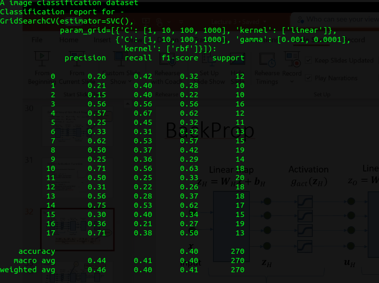

# Car_Logo_Detection

This repository consists of various methods tried to perform image classification on a very small Car Logo Data Set.

The Objective is to achieve maximum accuracy possible and trying out different methods.

While developing the model it came to my attention that the dataset was too small to perform transfer learning.
Needless to say, this implied that higher order network for more hidden layers would and did lead to overfitting of the data.

Starting with a simple Linear layer of 32 * 32 didn't help much as it failed to increase the accuracy from **8** percent.
Adding couple of more linear layers did help a bit but was not sufficient to use it for the classification.

Adding linear layer is same as adding Dense layer which is computationally intensive.

Also tested the dataset with CNN and classifcation layer and worked much better but need to tune it more.

Trying the training with Data Augmentation, But may not help as, the method fails to surpass the accuracy more than
**25%**.

It has been observed that the traditional SVMs on this dataset give Precision of about **75%**

